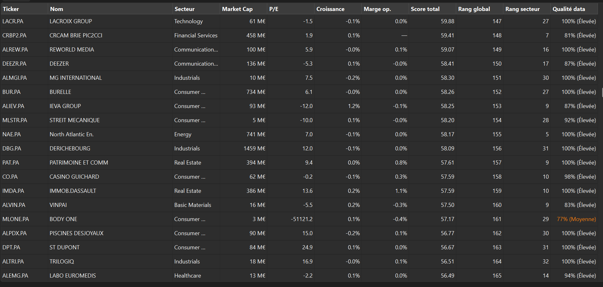
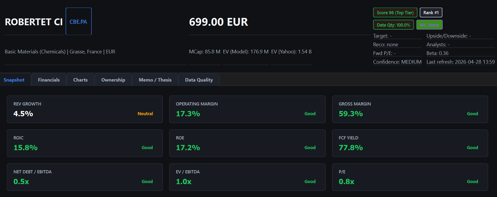
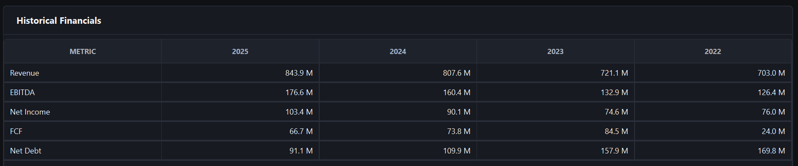

<div align="center">

# Small Cap Screener

Local-first desktop application to screen French listed small-cap companies with a deterministic and auditable workflow.


[](https://www.python.org/)
[](https://doc.qt.io/qtforpython/)
[](https://www.sqlalchemy.org/)
[](https://www.sqlite.org/)
[](https://github.com/ranaroussi/yfinance)
[](https://docs.astral.sh/ruff/)
[](https://pre-commit.com/)
[](https://pytest.org/)
[](https://python-semantic-release.readthedocs.io/)
[](LICENSE)
[](CHANGELOG.md)
[]()
[]()

## Problem Solved

Analysts often lose time between scattered data pulls, ad-hoc spreadsheets, and non-reproducible scoring logic.
This project provides one coherent workflow: ingest data, compute KPIs, score companies, rank the universe, and keep analyst decisions traceable.

</div>

---

## What This Is

Small Cap Screener is a **local desktop research platform** built for analysts and portfolio managers covering French-listed small and mid-cap equities — Euronext Paris, Euronext Growth, and Euronext Access.

It replaces the fragmented workflow of pulling data from Yahoo Finance, building ad-hoc spreadsheets, and maintaining scoring logic in Excel. Everything runs locally, with no cloud dependency, no SaaS account, and no data leaving your machine.

The output is a **ranked, scored, and annotated universe** you can review, filter, export, and compare against past snapshots — with every scoring decision traceable back to explicit, configurable rules.

---

## Why This Exists

Institutional coverage of French small caps is thin. When you are running a concentrated book or an ideas pipeline on 50–150 names, manual screening is the bottleneck. The typical analyst workflow looks like this:

- Pull data from a Bloomberg terminal or multiple free sources
- Maintain five separate spreadsheets per company
- Rebuild ranking every time you update a figure
- Lose last quarter's ranking when the sheet gets overwritten

This tool collapses that into one coherent workflow: **ingest → compute → score → rank → annotate → export** — reproducible on every run, persisted locally, and readable by the next analyst on the desk.

---

## Feature Set

### Universe & Data Ingestion

- **Euronext universe discovery** — seed and refresh investable universe from Euronext Paris, Growth, and Access
- **Ticker and ISIN ingestion** from the UI — no CSV preparation required
- **Automatic ticker resolution** — probes exchange suffixes (`.PA`, `.AL`, `.AM`, etc.) to resolve ambiguous identifiers
- **Yahoo Finance enrichment** — company profile, price history, income statement, balance sheet, cash flow, dividends, splits
- **Provider redundancy** — `ChainedProvider` with ordered fallback, `NoOpProvider` for offline/testing
- **Retry and fallback logic** — resilient batch refresh with per-company error tracking
- **Offline mode** — works against locally persisted data when provider is unavailable
- **Data quality scoring** — per-company confidence score based on data completeness and cross-field consistency
- **Stale data indicators** — freshness warnings visible in screener and detail views

### KPI Engine

- **Valuation ratios** — EV/EBITDA, P/E, P/B, P/S, EV/Sales, dividend yield
- **Quality metrics** — gross margin, EBITDA margin, net margin, ROE, ROCE, asset turnover
- **Growth indicators** — revenue CAGR, EBITDA CAGR, earnings growth, multi-year trend flags
- **Risk metrics** — net debt/EBITDA, interest coverage, current ratio, beta
- **Multi-year historical table** — per-company fundamentals going back up to 4 years with CAGR columns and trend direction
- **KPI snapshots** — point-in-time persistence for ranking history and comparison

### Scoring Engine

- **Deterministic multi-factor model** — four sub-scores: Quality, Value, Growth, Risk
- **Total score** with configurable sub-score weights (`src/services/scoring_config.py`)
- **Score transparency** — weighted decomposition per company, explicit positive and negative drivers
- **Global ranking** across the full universe by total score
- **Sector ranking** within peer group by total score
- **Reproducibility guarantee** — identical inputs always produce identical scores and rankings

### Analyst Research Workflow

- **Company detail dashboard** — full institutional-style view: profile, price, ratios, historical fundamentals, score breakdown, charts, peer comparison, memo
- **Charts** — price history, revenue/EBITDA evolution, margin trends, score component breakdown
- **Sector peer comparison** — valuation and quality/growth/risk ratios vs. sector median
- **Backtesting and ranking validation** — forward return analysis by score bucket, hit rate, top-vs-bottom spread
- **Ownership analysis** — major shareholder structure from provider data
- **Analyst memo workflow** — structured investment thesis: thesis statement, key risks, catalysts, valuation notes, next action
- **Watchlist** — status tracking per company: `watching`, `review`, `conviction`, `rejected`
- **Notes and exclusions** — persistent analyst annotations and universe exclusion flags

### Screening & Export

- **Screening table** — filterable, sortable universe view with live score, ranking, and data quality columns
- **Multi-criteria filters** — sector, market cap range, score range, data quality threshold, watchlist status
- **CSV and Excel exports** — filtered universe with metadata sheet; watchlist export; snapshot export
- **Screening snapshots** — freeze and label a filtered/ranked universe state, compare vs. current ranking
- **Snapshot diff** — identify rank movers, new entries, and exits between two snapshot dates

---

## Screenshots

### Screener — Ranked Universe

Full universe ranked by total score, with sector, market cap, key ratios, global/sector rank, and data quality indicator per company.



### Company Detail — KPI Snapshot

Institutional-style company dashboard: score tier, global rank, data quality badge, and color-coded KPI cards (margins, returns, leverage, valuation).



### Company Detail — Historical Financials

Multi-year financial table (Revenue, EBITDA, Net Income, FCF, Net Debt) with up to 4 years of history directly on the detail panel.



---

## Architecture

The project enforces a strict three-layer architecture with no bypass permitted between layers.

```
┌─────────────────────────────────────────────────┐
│                    UI Layer                      │
│   PySide6 widgets — display and input only       │
│   No calculations. No DB access. No API calls.  │
└──────────────────┬──────────────────────────────┘
                   │ calls
┌──────────────────▼──────────────────────────────┐
│                Services Layer                    │
│   All business logic, KPI, scoring, ranking     │
│   Orchestration, normalization, validation      │
└──────────────────┬──────────────────────────────┘
                   │ calls
┌──────────────────▼──────────────────────────────┐
│              Repository Layer                    │
│   SQLite/SQLAlchemy persistence                 │
│   Provider calls (Yahoo Finance, ChainedProvider)│
└─────────────────────────────────────────────────┘
```

**Why this architecture:**
- Financial logic lives exclusively in services — auditable, testable, no UI entanglement
- Providers are swappable — replace Yahoo Finance with a Bloomberg adapter without touching services or UI
- Repository layer makes the offline mode trivial — services never know if data comes from cache or a live fetch
- Scoring rules are deterministic and centralized — changing a weight in `scoring_config.py` propagates everywhere without side effects

### Service Inventory

| Service | Responsibility |
|---|---|
| `FinancialDataService` | Provider orchestration, retry, fallback, normalization |
| `NormalizationService` | Canonical data normalization (ticker, currency, financials) |
| `DataValidationService` | Cross-field consistency checks before persistence |
| `RatioService` | KPI and financial ratio computation |
| `KpiSnapshotService` | KPI snapshot creation and batch generation |
| `ScoringService` | Sub-scores, total score, global/sector ranking, score explanation |
| `ScreeningService` | Universe listing, filter/sort pipeline, exports, snapshots |
| `WatchlistService` | Notes, status, exclusion workflow, detail assembly |
| `TickerIngestionService` | End-to-end ticker/ISIN ingestion pipeline from UI |
| `TickerResolverService` | Exchange suffix probing and resolution |
| `UniverseDiscoveryService` | Single-company refresh, batch refresh, watchlist refresh |
| `UniverseService` | Investable universe queries and seed management |
| `CompanyDetailService` | Full company detail assembly (profile, ratios, history, score, memo) |
| `CompanyChartsService` | Chart-ready data for all visual components |
| `PeerComparisonService` | Sector median computation for peer benchmarking |
| `BacktestingService` | Ranking validation, bucket forward-return analysis, hit rate |
| `ExportService` | CSV and Excel export formatting helpers |

Full architecture reference: [`docs/ARCHITECTURE.md`](docs/ARCHITECTURE.md)

---

## Getting Started

**Requirements:** Python 3.11+, Windows (Linux/macOS untested)

```bash
git clone <repo-url>
cd small-cap-screener
python -m venv .venv
.venv\Scripts\activate
pip install -r requirements.txt
pre-commit install
```

**Run the application:**

```bash
python -m src.ui.app
```

**Run with the included demo dataset** (synthetic French small-cap universe, pre-scored and pre-ranked):

```bash
python -m src.demo_dataset   # builds/resets local demo data
python -m src.ui.app
```

The demo dataset includes a realistic synthetic universe with KPI snapshots, deterministic scoring, watchlist annotations, and one excluded company to demonstrate analyst filtering behavior.

---

## Development Standards

| Tool | Purpose |
|---|---|
| [`ruff`](https://docs.astral.sh/ruff/) | Linting and formatting (replaces flake8 + isort + black) |
| [`pre-commit`](https://pre-commit.com/) | Automated quality gates on every commit |
| [`pytest`](https://pytest.org/) | Unit and integration tests |
| [`python-semantic-release`](https://python-semantic-release.readthedocs.io/) | Automated versioning and changelog from Conventional Commits |

**Commit convention:** `feat|fix|docs|chore|test: <what and why>`

**Run quality checks:**

```bash
ruff check .          # lint
ruff format --check . # formatting
pytest                # test suite
```

Development guide: [`docs/DEVELOPMENT.md`](docs/DEVELOPMENT.md)

---

## Packaging

Build a standalone Windows executable with PyInstaller:

```bash
pip install -r requirements-dev.txt
python -m PyInstaller --clean --noconfirm small_cap_screener.spec
```

Output: `dist/small-cap-screener/small-cap-screener.exe`

Release process (automated on `main`): [`docs/RELEASE.md`](docs/RELEASE.md)

---

## Next Steps

### Near-Term (V1 Polish)

- **Institutional UI pass** — spacing, typography, and table formatting to match professional terminal aesthetics
- **Richer charting** — candlestick price view, portfolio-level aggregates, score evolution over time
- **Settings panel** — configure scoring weights, cache TTL, offline mode, default filters from the UI
- **Improved onboarding** — guided first-use flow, in-app demo mode activation, tooltip layer
- **Universe refresh automation** — scheduled background refresh with freshness thresholds
- **Database maintenance** — backup command, schema migration strategy, vacuum/cleanup tooling
- **Background workers** — non-blocking UI during batch refresh operations
- **Packaging polish** — versioned installer, app icon, smoke-test checklist after build

### V2 — AI Research Assistant

The next major capability layer is a **local AI research assistant** embedded in the workflow:

- **Investment thesis assistant** — AI-assisted memo drafting from company financials and analyst notes
- **Local LLM summarization** — run a local model (Ollama / llama.cpp) to summarize filings and news without sending data to a cloud API
- **Automated red flag detection** — scoring model cross-referenced against qualitative signals (revenue recognition, related-party disclosures, working capital anomalies)
- **Catalyst and risk extraction** — structured extraction of catalysts and risk factors from free-text filings
- **Annual report parser** — ingest PDF annual reports, extract key tables and management commentary
- **Transcript analysis** — earnings call transcript ingestion and structured Q&A extraction
- **Management quality scoring** — consistency scoring across guidance history and capital allocation track record
- **AI-assisted idea generation** — universe-level pattern matching to surface names with similar characteristics to existing high-conviction positions

---

## Documentation

| Document | Content |
|---|---|
| [`docs/ARCHITECTURE.md`](docs/ARCHITECTURE.md) | Layered architecture, service ownership, guardrails |
| [`docs/ROADMAP.md`](docs/ROADMAP.md) | Delivered milestones and planned phases |
| [`docs/DEVELOPMENT.md`](docs/DEVELOPMENT.md) | Dev setup, quality gates, testing guide |
| [`docs/RELEASE.md`](docs/RELEASE.md) | Semantic release process and versioning |
| [`docs/KNOWN_LIMITATIONS.md`](docs/KNOWN_LIMITATIONS.md) | Current data and provider limitations |
| [`STACK.md`](STACK.md) | Technology choices and constraints |
| [`CHANGELOG.md`](CHANGELOG.md) | Full version history |

---

## License

MIT — see [`LICENSE`](LICENSE)
