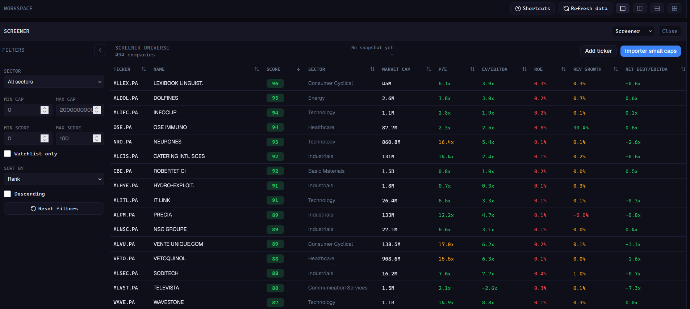
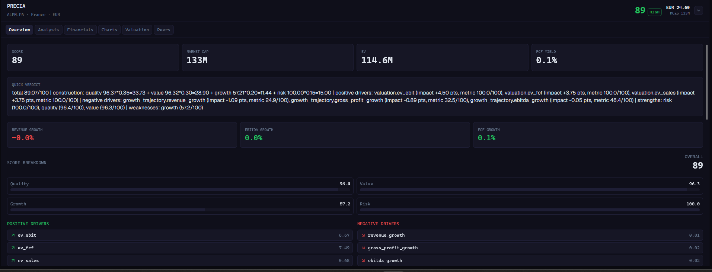
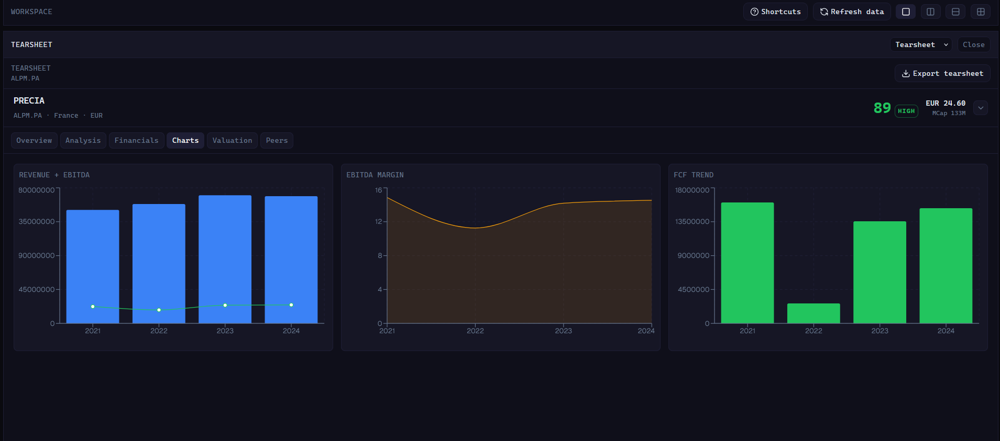
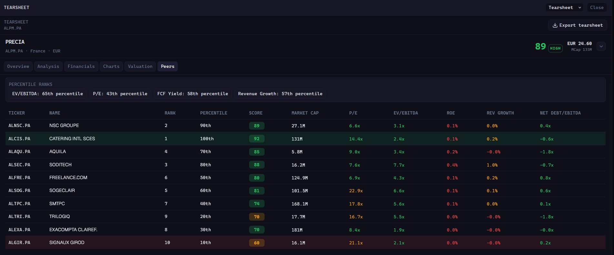

<div align="center">

# Small Cap Screener

**Version 2.4.0 — local-first research terminal for French small & mid caps**

[](CHANGELOG.md)
[](https://www.python.org/)
[](https://fastapi.tiangolo.com/)
[](https://react.dev/)
[](https://www.typescriptlang.org/)
[](https://www.sqlite.org/)
[](https://www.sqlalchemy.org/)
[](LICENSE)

</div>

---

## What This Project Is

Small Cap Screener is a local research platform for buy-side workflows on French listed small and mid-cap equities (Euronext Paris, Growth, Access).

The app centralizes the workflow:

`ingest → normalize → compute KPI → score → rank → annotate → export`

Everything runs locally, with no cloud dependency and no mandatory external SaaS account.

---

## Architecture

```
Frontend (React + TypeScript + Vite)
            ↓
API layer (FastAPI + Pydantic)
            ↓
Services (business logic)
            ↓
Repositories (DB / API access)
            ↓
SQLite
```

Core rules:
- no business logic in the frontend
- API routers call services only
- repositories own all persistence and provider I/O

Reference: [STACK.md](STACK.md) and [docs/ARCHITECTURE.md](docs/ARCHITECTURE.md)

---

## Main Features

### Universe & Enrichment
- Euronext France universe discovery and import
- Ticker and ISIN ingestion
- Yahoo Finance enrichment with fallback logic
- Data freshness and quality indicators per company

### Scoring & Screening
- 8-bloc deterministic fundamental scoring engine (see below)
- Global and sector ranking
- Filterable and sortable screener with snapshot export
- Company profile classification

### Analyst Workflow
- Tearsheet with KPIs, score breakdown, historical financials, and price chart
- Peer comparison and signal panels
- Watchlist with memo and status management

### Export
- CSV and Excel exports from filtered or snapshot views

---

## Scoring Engine

The scoring engine produces a **total score (0–100)** computed from **8 internal blocs**, each covering a distinct analytical dimension. The blocs aggregate into 4 public sub-scores that are weighted into the total.

### 8 blocs → 4 sub-scores

| Bloc | Weight | Metrics | Sub-score |
|---|---|---|---|
| `business_quality` | 15% | gross_margin, roic, roce, asset_turnover | **Quality** (35%) |
| `profitability` | 14% | gross_profitability, roa, roic, ebit_margin | **Quality** (35%) |
| `cash_flow_quality` | 12% | cfo_to_net_income, cfo_to_ebit, fcf_margin, cfo_margin, cfo_streak_negative | **Quality** (35%) |
| `valuation` | 10% | ev_ebit, ev_fcf, ev_sales, pb_ratio | **Value** (30%) |
| `growth_trajectory` | 12% | gross_profit_growth, revenue_growth, revenue_cagr_3y, ebitda_growth | **Growth** (20%) |
| `capital_allocation` | 10% | ronic, capex_to_revenue, shares_growth | **Growth** (20%) |
| `balance_sheet_strength` | 14% | net_debt_to_ebitda, interest_coverage, current_ratio, debt_to_equity | **Risk** (15%) |
| `risk_inverse` | 13% | altman_z_proxy, beta, accrual_ratio | **Risk** (15%) |

Each metric is scored 0–100 by linear interpolation between a `good` and `bad` threshold defined in `scoring_config.py`. Missing metrics score 0 and reduce the effective weight of their bloc.

### Pipeline

```
compute 8 blocs
    → bridle valuation (cap at 50 if quality or risk avg < 30)
    → apply reinvestment CFO relief (lift cash_flow_quality to floor 35 if reinvestment phase)
    → aggregate into 4 sub-scores
    → weighted total
    → anti-compensation penalty (min bloc score < 20 → penalty applied)
    → context adjustment (mutually exclusive, −11 to +6)
    → red flag cap
    → clamp [0, 100]
```

### Context adjustments (mutually exclusive)

| Profile | Adjustment |
|---|---|
| distressed | −11 pts |
| value_trap | −10 pts |
| turnaround (unconfirmed) | −2 pts |
| turnaround (confirmed) | +2 pts |
| cyclical | +5 pts |
| reinvestment_phase | +6 pts |

### Red flag caps

| Condition | Cap |
|---|---|
| Distressed (high debt + low coverage) | 35 |
| Value trap (shrinking revenue + rich valuation) | 45 |
| Dangerous debt (net debt / EBITDA > 4) | 45 |
| Unconfirmed turnaround (negative EBIT, weak growth) | 65 |

### Company profile labels

Each snapshot is classified into one mutually exclusive profile (stored as `profile_label`):

`compounder` · `reinvestment_phase` · `cyclical` · `turnaround` · `value_trap` · `distressed` · `low_visibility` · `standard`

The cascade follows the order above: distress is checked first, compounder last before standard.

---

## App Screenshots

### Screener


### Company Overview


### Company Charts


### Peer Comparison


---

## Scoring Model (v2, verified against `main`)

The active screener scoring is deterministic and computed server-side in `ScoringService` from KPI snapshots. The legacy `compute_score()` helper still exists for backward compatibility, but KPI snapshots use the sub-score model below.

### 1) Four sub-scores (0-100)

- Quality: `roe`, `roic`, `operating_margin`, `gross_margin`
- Value: `pe_ratio`, `pb_ratio`, `ev_ebitda`, `fcf_yield`
- Growth: `revenue_growth`, `ebitda_growth`
- Risk: `net_debt_to_ebitda`, `current_ratio`, `interest_coverage`

Each metric is transformed to a normalized score between 0 and 100 using good/bad thresholds, linear interpolation between thresholds, and direction-aware logic: lower-is-better or higher-is-better.

### 2) Per-metric rules

| Category | Metric | Weight | Good | Bad | Direction |
| --- | --- | ---: | ---: | ---: | --- |
| Quality | `roe` | `0.35` | `0.15` | `0.00` | higher is better |
| Quality | `roic` | `0.25` | `0.12` | `0.00` | higher is better |
| Quality | `operating_margin` | `0.25` | `0.12` | `0.00` | higher is better |
| Quality | `gross_margin` | `0.15` | `0.30` | `0.10` | higher is better |
| Value | `pe_ratio` | `0.30` | `10.0` | `25.0` | lower is better |
| Value | `pb_ratio` | `0.20` | `1.0` | `3.0` | lower is better |
| Value | `ev_ebitda` | `0.30` | `6.0` | `15.0` | lower is better |
| Value | `fcf_yield` | `0.20` | `0.08` | `0.00` | higher is better |
| Growth | `revenue_growth` | `0.60` | `0.10` | `-0.05` | higher is better |
| Growth | `ebitda_growth` | `0.40` | `0.10` | `-0.05` | higher is better |
| Risk | `net_debt_to_ebitda` | `0.50` | `1.0` | `4.0` | lower is better |
| Risk | `current_ratio` | `0.25` | `1.5` | `0.8` | higher is better |
| Risk | `interest_coverage` | `0.25` | `6.0` | `1.0` | higher is better |

When some metrics are missing inside a category, the available metric weights are normalized within that category.

### 3) Category weights

Default global weights are:

- Quality: `0.35`
- Value: `0.30`
- Growth: `0.20`
- Risk: `0.15`

Total score formula:

`total_score = quality*0.35 + value*0.30 + growth*0.20 + risk*0.15`

Weights are configurable in settings and persisted in snapshot metrics (`score_weight_quality`, `score_weight_value`, `score_weight_growth`, `score_weight_risk`) for score traceability.

### 4) Ranking outputs

- Global rank (all scored companies)
- Sector rank (within normalized sector buckets)
- Driver explanations (top positive and negative metric contributors)

### 5) Data quality score

In parallel, a `data_quality_score` (0-100) is computed in `KpiSnapshotService` to qualify confidence in each row:

- Financial statement completeness: `40%`
- Price availability quality: `20%`
- Market cap availability quality: `20%`
- Ratio completeness: `20%`

---

## Data Tracked

The platform tracks and stores the following dataset for each company:

### Company identity & profile

- ISIN, ticker, name, country, market, sector, industry, currency
- Website, business summary, employees, city, phone

### Market data

- Market cap, average daily volume, beta
- Historical prices, dividends, splits

### Financial statements

- Revenue, EBIT, EBITDA, net income
- Total assets, total equity, total debt, net debt
- Free cash flow, shares outstanding

### Ratios and KPIs

- Valuation: `pe_ratio`, `pb_ratio`, `ev_ebitda`, `ev_ebit`, `fcf_yield`
- Quality: `roe`, `roic`, `roce`, `gross_margin`, `operating_margin`, `ebitda_margin`
- Growth: `revenue_growth`, `ebitda_growth`
- Risk: `net_debt_to_ebitda`, `current_ratio`, `interest_coverage`

### Snapshot and scoring metadata

- KPI snapshots by date (`kpi_snapshots`)
- Sub-scores: quality/value/growth/risk
- Total score, global rank, sector rank
- Score weights used at computation time
- Data quality score

### Analyst workflow data

- Watchlist membership and status
- Notes and analyst memo fields (thesis, risks, next review date)
- Screening snapshots for historical comparison and export

---

## Tech Stack

### Backend
- Python 3.11+
- FastAPI, Uvicorn, Pydantic
- SQLAlchemy, SQLite
- pandas, numpy, yfinance

### Frontend
- React 18 + Vite
- TypeScript (strict)
- React Router
- TanStack Query
- Tailwind CSS + shadcn/ui

---

## Getting Started (Development)

### 1) Backend setup

```bash
python -m venv .venv
.venv\Scripts\activate
pip install -r requirements.txt
pip install -r requirements-dev.txt
```

### 2) Frontend setup

```bash
cd frontend
npm install
cd ..
```

### 3) Run backend API

```bash
.venv\Scripts\activate
uvicorn api.main:app --reload --host 127.0.0.1 --port 8000
```

### 4) Run frontend

```bash
cd frontend
npm run dev
```

Frontend runs on the Vite dev server and proxies API calls to `/api`.

---

## Quality Checks

Backend:
```bash
ruff check .
ruff format --check .
pytest
```

Frontend:
```bash
cd frontend
npm run lint
npm run build
```

---

## Documentation

- [docs/ARCHITECTURE.md](docs/ARCHITECTURE.md)
- [docs/DEVELOPMENT.md](docs/DEVELOPMENT.md)
- [docs/RELEASE.md](docs/RELEASE.md)
- [docs/KNOWN_LIMITATIONS.md](docs/KNOWN_LIMITATIONS.md)
- [STACK.md](STACK.md)
- [CHANGELOG.md](CHANGELOG.md)

---

## License

MIT — see [LICENSE](LICENSE)
